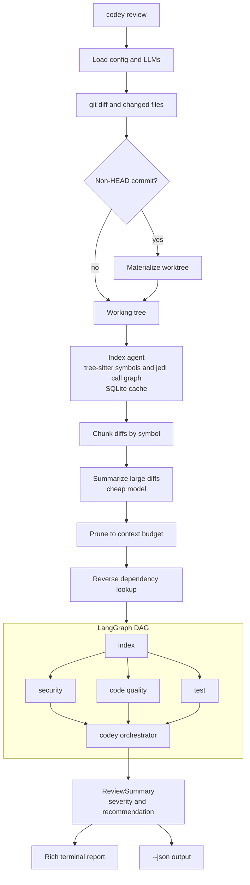

# codey

[](https://pypi.org/project/codey-review/)
[](https://pypi.org/project/codey-review/)
[](https://opensource.org/licenses/MIT)

Production grade multi-agent AI code review system. Codey orchestrates four specialist agents (security, code quality, testing, indexing) over a commit diff, then emits a structured verdict with a recommendation.

Built on LangGraph with tree-sitter AST caching and jedi based reverse dependency lookup.

## Install

Codey requires Python 3.13+.

```bash
pip install codey-review
```

Or with uv:

```bash
uv tool install codey-review
```

The package on [PyPI](https://pypi.org/project/codey-review/) is named `codey-review`. The CLI command and Python import are both `codey`.

## Quick start

```bash
codey set       # configure provider, API key, and models
codey review    # review the latest commit (HEAD~1..HEAD)
codey review <commit>   # review a specific commit
```

## Commands

| Command | Purpose |
|---------|---------|
| `codey set` | Configure provider, API key, and models interactively |
| `codey unset [PROVIDER]` | Remove a provider's credentials and configuration |
| `codey model` | View or switch the active model |
| `codey config` | Show configuration or toggle commit summary append |
| `codey graph` | Inspect the indexed symbol, call, and import graph |
| `codey review [COMMIT]` | Review a commit, latest by default |

`codey review` options: `--no-progress`, `--force-index`, `--run-tests` (requires confirmation), `--json` (machine readable output for CI).

## Providers

| Provider | API key | Models |
|----------|---------|--------|
| OpenAI | required | gpt-4.1, gpt-4.1-mini, gpt-4o, o3-mini |
| Anthropic | required | Claude Sonnet, Haiku, Opus |
| DeepSeek | required | deepseek-chat, deepseek-reasoner |
| Google | required | Gemini 2.5 Pro, Gemini 2.0 Flash |
| Custom (OpenAI compatible) | required | any endpoint via `base_url` |
| Local | none | Ollama, LM Studio, llama.cpp, vLLM via `/v1` |

`codey set` and `codey model` fetch the live model list from each provider's API and fall back to the bundled list when the provider is unreachable.

## Features

### Security analysis

- Deterministic hardcoded secret detector with prefix rules and Shannon entropy filtering. Scans the raw diff, never an LLM summary.
- Optional bandit (Python), semgrep (multi-language), and gitleaks (secrets, scoped to the commit).
- LLM confidentiality judgement for issues with no regex anchor: PII, internal endpoints, weak crypto, command injection, leaking logs.

### Code quality

- Benchmarks the diff against conventions found in the indexed codebase: naming, typing, docstrings, error handling, structure.
- Verbatim evidence enforcement. Findings without a real code snippet are discarded.

### Testing

- Detects the test framework automatically: pytest, npm, go, cargo, rake.
- Opt in execution via `--run-tests` with an explicit confirmation. Repo code is never run implicitly.

### Indexing and caching

- tree-sitter parsing cached in SQLite at `~/.cache/codey/codey.db`, keyed by git hash. Only changed files are re-parsed.
- jedi based call graph with reverse dependency lookup that surfaces affected but unmodified files to the review.

### Review pipeline

- AST aware diff chunking at function and class granularity.
- Context window budgeting with a cheap summarizer for large diffs. Pruned ranges are reported, never silently dropped.
- LangGraph DAG fans out to the security, code quality, and test agents in parallel.

### Output

- Rich terminal report with a severity colored findings table and per agent overview.
- `--json` for CI gates and machine readable consumption.
- Optional append of the summary to the reviewed commit message, HEAD only.

## Architecture



The index agent builds the symbol table and architecture summary first. Security, code quality, and test agents then run in parallel. The codey orchestrator synthesizes their reports into a final verdict. A deterministic recommendation is computed first, and the LLM can only make it stricter, never more optimistic.

## Development

```bash
git clone https://github.com/arihant/codey
cd codey
uv sync
uv run pytest tests/
uv run ruff check codey/
```

## License

MIT
